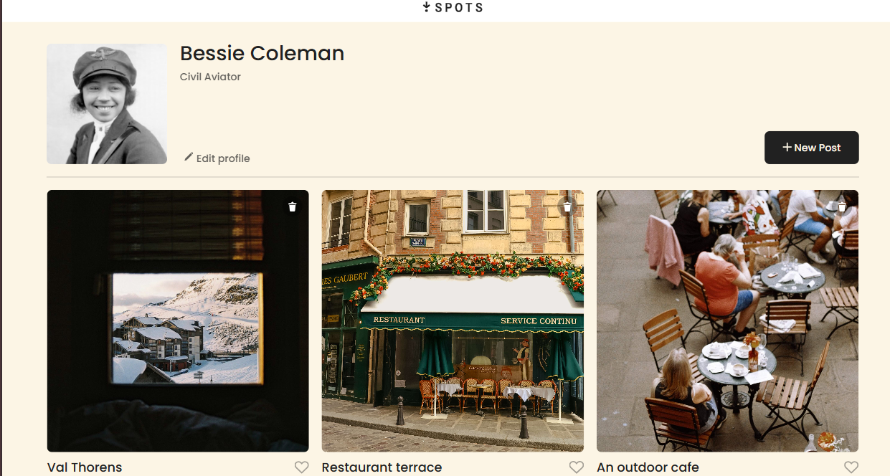
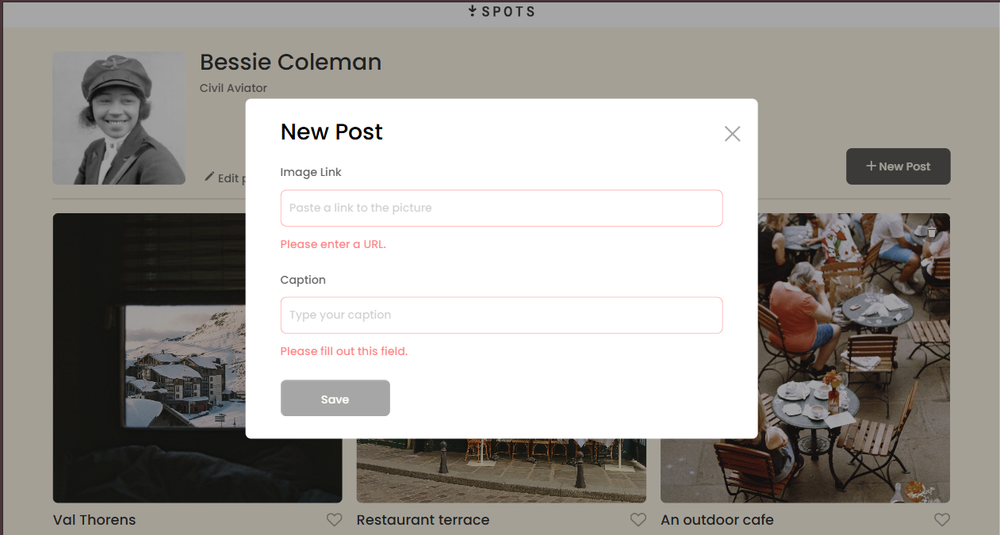

# 📸 Spots — An Image Sharing Web App

A clean, responsive image-sharing platform where users can view, like, and delete cards — and even add their own posts using a custom-built modal form with validation.

Built with ❤️ as part of my **Front-End Engineering** journey at **TripleTen**.

---

## 🖼️ Preview

---

## 💻 Tech Stack

- **HTML5**
- **CSS3**
- **JavaScript (Vanilla)**
- Responsive Design
- Form Validation using the `ValidityState` API

---

## 🚀 Live Deployment

👉 [**View Live on GitHub Pages**](https://jadenb22.github.io/se_project_spots/)

---

## 📽️ Demo Video

> 📂 [Click here for video demo](./images/spotsvideo.mp4)

---

## 🔍 Key Features

- Add new image cards via modal form
- Built-in form validation with custom error messages
- Dynamic like/unlike buttons
- Remove cards with a click
- Fully responsive layout
- Escape key & background click close modals
- Custom error display using `textContent` from `validationMessage`

---

## 🧠 What I Learned

- How to write reusable, modular JS for validation and UI interaction
- How to control modal accessibility and UX
- The value of clean code structure and component-based thinking
- How to debug through styling and event listeners

---

## 🙋🏽‍♀️ About Me

👩🏽‍💻 **Jaden B.** — Aspiring Front-End Engineer  
Currently leveling up at [TripleTen](https://tripleten.com)  
Passionate about turning creative ideas into clean, functional code.

---

## 📬 Let’s Connect

- [LinkedIn](https://www.linkedin.com/in/jaden-barron-4341b3339/)
- [GitHub](https://github.com/jadenb22)
